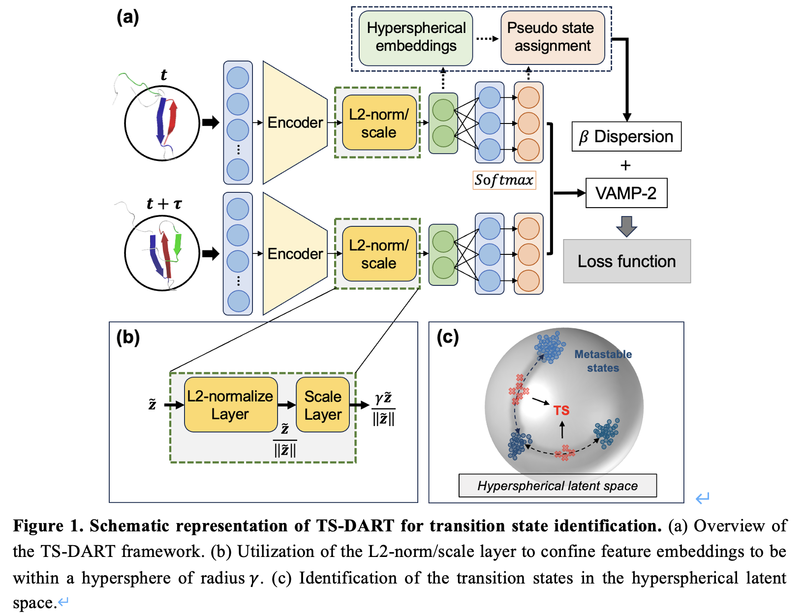

# TS-DART: Transition State identification via Dispersion and vAriational principle Regularized neural neTworks

### Abstract

Identifying transitional states is crucial for understanding protein conformational changes that underlie numerous fundamental biological processes. Markov state models (MSMs) constructed from Molecular Dynamics (MD) simulations have demonstrated considerable success in studying protein conformational changes, which are often associated with rare events transiting over free energy barriers. However, it remains challenging for MSMs to identify the transition states, as they group MD conformations into discrete metastable states and do not provide information on transition states lying at the top of free energy barriers between metastable states. Inspired by recent advances in trustworthy artificial intelligence (AI) for detecting out-of-distribution (OOD) data, we present Transition State identification via Dispersion and vAriational principle Regularized neural neTworks (TS-DART). This deep learning approach effectively detects the transition states from MD simulations using hyperspherical embeddings in the latent space.  The key insight of TS-DART is to treat the transition state structures as OOD data, recognizing that the transition states are less populated and exhibit a distributional shift from metastable states. Our TS-DART method offers an end-to-end pipeline for identifying transition states from MD simulations. By introducing a dispersion loss function to regularize the hyperspherical latent space, TS-DART can discern transition state conformations that separate multiple metastable states in an MSM. Furthermore, TS-DART provides hyperspherical latent representations that preserve all relevant kinetic geometries of the original dynamics. We demonstrate the power of TS-DART by applying it to a 2D-potential, alanine dipeptide and the translocation of a DNA motor protein on DNA. In all these systems, TS-DART outperforms previous methods in identifying transition states. As TS-DART integrates the dimensionality reduction, state decomposition, and transition state identification in a unified framework, we anticipate that it will be applicable for studying transition states of protein conformational changes. 

### Illustration



## Installation from sources

The source code can be installed with a local clone:

```bash
git clone https://github.com/xuhuihuang/ts-dart.git
```

```bash
python -m pip install ./ts-dart
```
## Quick start

### Start with jupyter notebook

Check this file:

```
./ts-dart/example/quadruple-well-example.ipynb
```

### Start with python script (Linux)

```sh
python ./ts-dart/scripts/train_tsdart.py \
    --seed 1 \
    --device 'cpu' \
    --lag_time 10 \
    --encoder_sizes 2 20 20 20 10 2 \
    --feat_dim 2 \
    --n_states 2 \
    --beta 0.01 \
    --gamma 1 \
    --proto_update_factor 0.5 \
    --scaling_temperature 0.1 \
    --learning_rate 0.001 \
    --pretrain 10 \
    --n_epochs 20 \
    --train_split 0.9 \
    --train_batch_size 1000 \
    --data_directory ./ts-dart/data/quadruple-well \
    --saving_directory . 
```

Or
```
sh ./ts-dart/scripts/train_tsdart.sh
```

## Reference

Our codebase builds heavily on
- [https://github.com/deeplearning-wisc/cider](https://github.com/deeplearning-wisc/cider)
- [https://github.com/deeptime-ml/deeptime](https://github.com/deeptime-ml/deeptime)

Thanks for open-sourcing!

[Go to Top](#Abstract)
